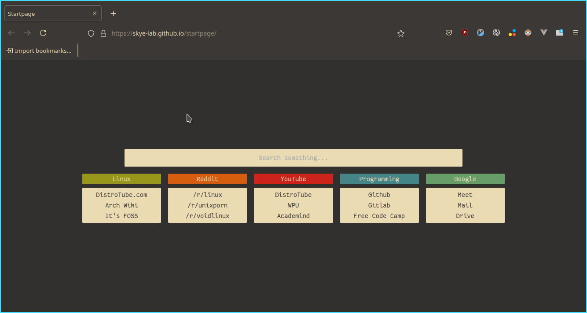

# Showcase

## Installation

To use this startpage, first, you must instal the following browser extension:

- [New Tab Override](https://addons.mozilla.org/en-US/firefox/addon/new-tab-override/) for Firefox based browser
- [New Tab Override](https://chrome.google.com/webstore/detail/new-tab-override/fjcmlondipcnnpmbcollgifldmajfonf/) for Chromium based browser

Then, set the `custom url` to `https://skye-lab.github.io/startpage/`.
